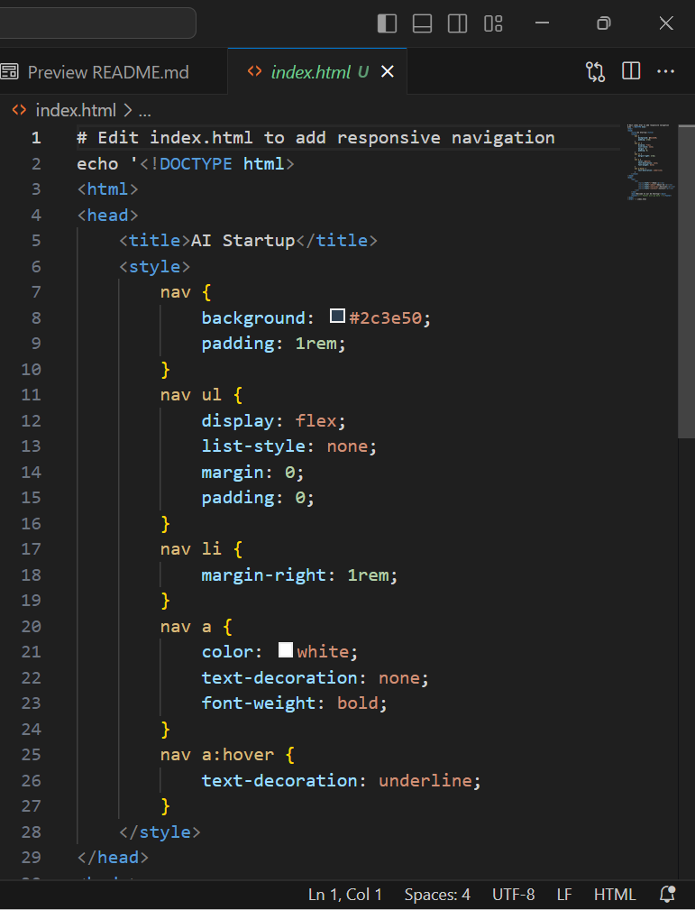

# Git Collaboration: Tom's Workflow Documentation

## Project Context
A team is developing a website for an AI startup using Git for version control. Two developers (Tom and Jerry) need to modify the same `index.html` file simultaneously:
- **Tom's Task**: Update the navigation bar
- **Jerry's Task**: Add contact information to the footer

## Prerequisites
- Git installed locally
- Access to central repository (GitHub)
- Clone of the project repository

## Tom's Step-by-Step Workflow

### 1. Fork the project's repository
- Since Tom was only sent the projects URL, his first step was to fork the repository to enable him contribute to the project.


### 2. Initialize Workspace
- Using bash CLI clone the repository and cd into the project directory.
```bash
# This bash command will clone the repository (since have already forked it into Tom's repository)

git clone https://github.com/Ozy-oamen/ai-startup-website.git 
```


- Start from the origin main branch and update Tom's copy of the project with the commands below.
```bash
# The commands below will Ensure Tom start from the origin main branch and have the lastest version of the project.

git checkout main
git pull origin main
```


### 3. Create Feature Branch

- Creating a feature branch will enable Tom add the navigation bar feature with out interferring with the man branch.

```bash
# This command will create a new feature branch "update-navigation".

git checkout -b update-navigation
```


### 3. Make Changes
- Open index.html in your editor

- Modify the navigation bar HTML

- Save the file



